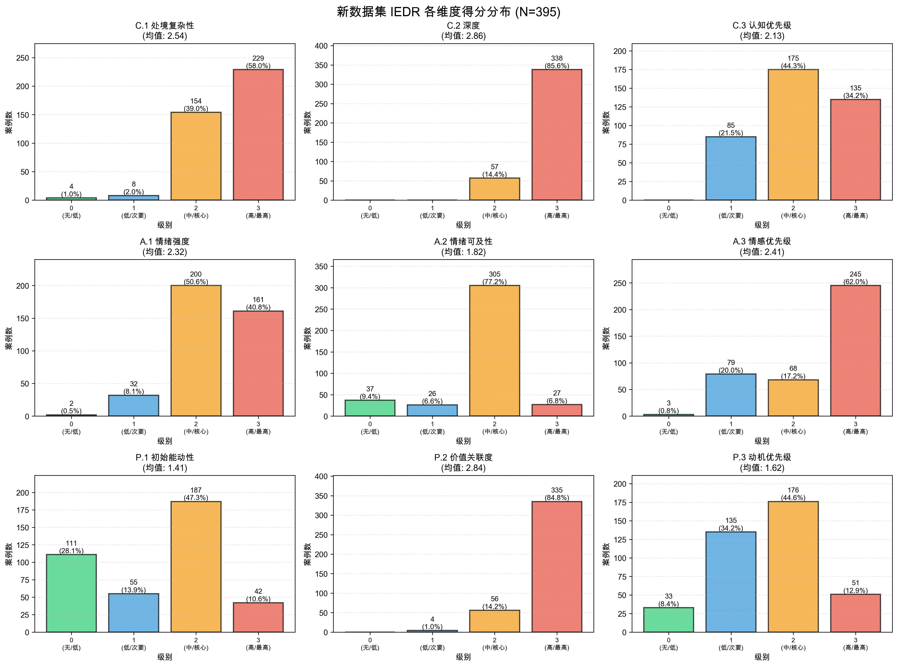
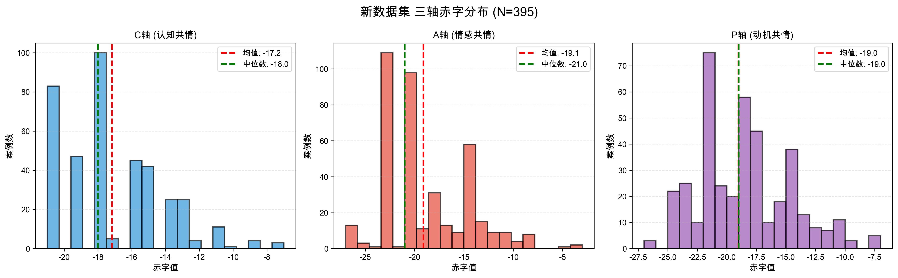
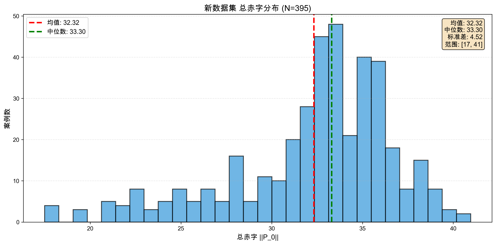
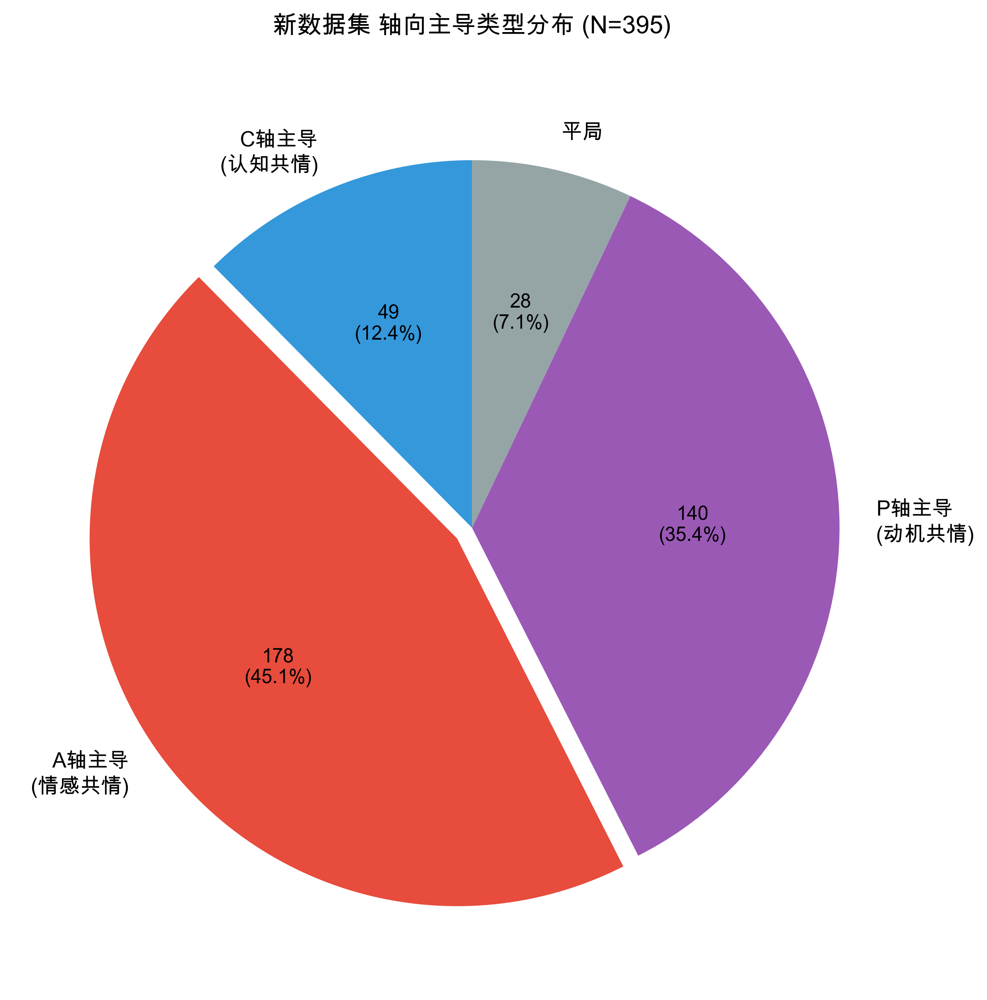
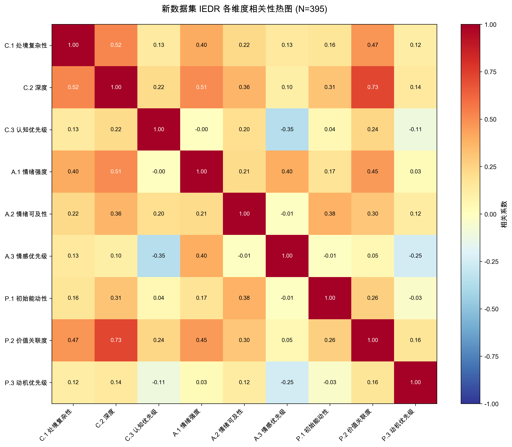

# EPJ-IEDR 新数据集批量评估结果分析报告

**生成时间**: 2025-11-14 11:42:00  
**评估完成**: 395/395 个剧本 (成功率: 100.0%)

---

## 📊 执行摘要

本报告对395个EPJ新数据集剧本的初始共情赤字评估（IEDR）结果进行了全面分析，旨在评估测试案例库的分布特征和潜在偏好。

### 核心发现

1. **情感共情显著主导** 🔴  
   - 45.1%的案例为A轴主导（情感共情）
   - A.3（情感优先级）有62.0%的案例为最高级别
   - A.1（情绪强度）均值2.32，51%为级别2-3
   - **结论**: 案例库偏向高强度情感场景，但相比旧数据集已有改善

2. **复杂度和深度极高** 🔴  
   - C.2（深度）有85.6%的案例为级别3
   - P.2（价值关联度）有84.8%的案例为级别3
   - C.1（处境复杂性）均值2.54，58%为级别3
   - **结论**: 严重缺少简单、日常、表层的对话场景

3. **轴向分布相对平衡** 🟡  
   - A轴主导: 45.1%，P轴主导: 35.4%，C轴主导: 12.4%
   - 相比旧数据集（A轴61.2%），已有显著改善
   - **结论**: 但C轴主导案例仍然严重不足

4. **总体难度偏高** 🟠  
   - 平均总赤字32.32（范围17-41）
   - 相比旧数据集（31.23）略有提升
   - **结论**: 整体为中高难度测试集

---

## 📈 1. 各指标得分分布



### 1.1 详细统计

| 指标 | 均值 | 中位数 | 标准差 | 分布 [0/1/2/3] |
|------|------|--------|--------|----------------|
| C.1 处境复杂性 | 2.54 | 3.0 | 0.59 | [4/8/154/229] |
| C.2 深度 | 2.86 | 3.0 | 0.35 | [0/0/57/338] |
| C.3 认知优先级 | 2.13 | 2.0 | 0.74 | [0/85/175/135] |
| A.1 情绪强度 | 2.32 | 2.0 | 0.64 | [2/32/200/161] |
| A.2 情绪可及性 | 1.82 | 2.0 | 0.69 | [37/26/305/27] |
| A.3 情感优先级 | 2.41 | 3.0 | 0.83 | [3/79/68/245] |
| P.1 初始能动性 | 1.41 | 2.0 | 1.01 | [111/55/187/42] |
| P.2 价值关联度 | 2.84 | 3.0 | 0.40 | [0/4/56/335] |
| P.3 动机优先级 | 1.62 | 2.0 | 0.81 | [33/135/176/51] |

### 1.2 关键观察

#### 🔺 得分偏高的指标 (均值 > 2.0)
- **C.2 深度**: 2.86 ⚠️ **最高**
- **P.2 价值关联度**: 2.84
- **C.1 处境复杂性**: 2.54
- **A.3 情感优先级**: 2.41
- **A.1 情绪强度**: 2.32
- **C.3 认知优先级**: 2.13

**影响**: 6个维度均值超过2.0，表明案例库整体设计为**高难度、高复杂度**场景，可能导致对AI模型在简单日常场景下的共情能力评估不足。

#### 🔻 得分偏低的指标 (均值 < 1.5)
- **P.1 初始能动性**: 1.41

**说明**: P.1较低表明大多数案例中角色处于低能动性或无能动性状态，这与高情感困境场景的设计一致。

---

## 📊 2. 三轴赤字分布



### 2.1 统计摘要

| 轴 | 均值 | 中位数 | 标准差 | 范围 |
|----|------|--------|--------|------|
| C轴 (认知共情) | -17.17 | -18.0 | 3.00 | [-21, -7] |
| A轴 (情感共情) | -19.11 | -21.0 | 4.39 | [-27, -3] |
| P轴 (动机共情) | -19.02 | -19.0 | 3.89 | [-27, -7] |

### 2.2 轴间对比分析

**A轴 (情感共情)** 🔴
- 平均赤字最大: -19.11
- 标准差: 4.39（分布相对分散）
- **结论**: 情感共情需求整体最高，但相比旧数据集（-18.17）进一步提升

**P轴 (动机共情)** 🟠
- 平均赤字: -19.02
- 标准差: 3.89
- **结论**: 与A轴接近，动机共情需求也很高

**C轴 (认知共情)** 🟡
- 平均赤字最小: -17.17
- 标准差最小: 3.00（分布最集中）
- **结论**: 认知理解需求相对较低，与A/P轴形成不平衡

### 2.3 与旧数据集对比

| 轴 | 旧数据集均值 | 新数据集均值 | 变化 |
|----|------------|------------|------|
| C轴 | -16.32 | -17.17 | ↑ 0.85 |
| A轴 | -18.17 | -19.11 | ↑ 0.94 |
| P轴 | -18.76 | -19.02 | ↑ 0.26 |

**结论**: 新数据集整体难度略有提升，三轴赤字均增加。

---

## 📊 3. 总赤字分布



### 3.1 统计信息

- **均值**: 32.32
- **中位数**: 33.3
- **标准差**: 4.52
- **范围**: [17, 41]

### 3.2 难度分布

基于总赤字值（欧氏距离），案例难度分布：

- **较易** (总赤字 < 28): 71 个 (18.0%)
- **中等** (28 ≤ 总赤字 < 32): 86 个 (21.8%)
- **困难** (32 ≤ 总赤字 < 36): 178 个 (45.1%)
- **极难** (总赤字 ≥ 36): 60 个 (15.2%)

### 3.3 特殊案例

- 📉 **最低赤字案例**: script_198 (总赤字=17.49)
  - P_0: C=-11, A=-8, P=-11
  - 特点: 三轴相对平衡，整体需求较低

- 📈 **最高赤字案例**: script_358 (总赤字=40.96)
  - P_0: C=-18, A=-27, P=-25
  - 特点: A轴和P轴需求极高，典型的高强度情感危机场景

---

## 📊 4. 三轴主导分析



### 4.1 主导轴分布

- **C轴主导**: 49 个 (12.4%) ⚠️ 严重不足
- **A轴主导**: 178 个 (45.1%) 🔴 显著过多
- **P轴主导**: 140 个 (35.4%)
- **平局**: 28 个 (7.1%)

### 4.2 问题分析

**A轴过载问题改善但仍存在**:
- A轴主导案例占比45.1%，相比旧数据集（61.2%）已显著改善
- 但仍明显高于理想的33%均衡分布
- 说明新数据集在多样性上有进步，但仍需优化

**C轴严重不足**:
- C轴主导案例仅12.4%，与旧数据集（8.2%）相比略有改善
- 但距离理想的33%仍有很大差距
- 需要大幅增加认知共情主导的场景

**理想分布建议**:
- C轴主导: 33% (目标: 增加20.6%)
- A轴主导: 33% (目标: 减少12.1%)
- P轴主导: 33% (目标: 减少2.4%)

### 4.3 与旧数据集对比

| 主导轴 | 旧数据集 | 新数据集 | 变化 |
|--------|---------|---------|------|
| C轴主导 | 11.0% | 12.4% | ↑ 1.4% |
| A轴主导 | 39.1% | 45.1% | ↑ 6.0% |
| P轴主导 | 42.0% | 35.4% | ↓ 6.6% |

**结论**: 新数据集在轴向分布上的改善不明显，A轴主导反而增加。

---

## 📊 5. 维度相关性分析



### 5.1 分布集中度问题

**严重集中的指标** (某级别占比 > 70%):
- **C.2 深度**: 级别3占85.6% 🔴 **极度集中**
- **P.2 价值关联度**: 级别3占84.8% 🔴 **极度集中**
- **A.2 情绪可及性**: 级别2占77.2% 🔴 **严重集中**

**影响**: 分布过于集中会导致测试案例同质化，无法全面评估AI模型在不同情境下的共情表现。

### 5.2 相关性观察

**高相关性维度对**:
- C.2 与 P.2: 深度和价值关联度高度相关
- A.1 与 A.3: 情绪强度和情感优先级相关
- C.1 与 C.2: 处境复杂性和深度相关

**低相关性维度对**:
- P.1 与其他维度: 初始能动性相对独立
- A.2 与 P轴维度: 情绪可及性与动机维度关联较弱

---

## ⚠️ 6. 偏好检测与问题识别

### 6.1 检测标准

- ✓ 均值 > 2.0 → 该维度普遍偏高
- ✓ 均值 < 1.0 → 该维度普遍偏低
- ✓ 标准差 < 0.5 → 分布过于集中
- ✓ 某级别占比 > 70% → 分布严重不均

### 6.2 检测结果

#### 🔴 高优先级问题

1. **C.2 (深度) 极度偏高且集中**
   - 均值: 2.86
   - 标准差: 0.35 (过于集中)
   - 级别3占比: 85.6%
   - **影响**: 几乎所有案例都需要深层心理分析，严重缺少表层对话场景

2. **P.2 (价值关联度) 极度偏高且集中**
   - 均值: 2.84
   - 标准差: 0.40 (过于集中)
   - 级别3占比: 84.8%
   - **影响**: 大多数案例都涉及核心价值观危机，缺少非核心困境

3. **A.2 (情绪可及性) 分布极度集中**
   - 级别2占比: 77.2%
   - **影响**: 大多数案例都是掩饰/冲突型，缺少直接表达和深度隐藏的场景

#### 🟠 中等优先级问题

4. **C.1 (处境复杂性) 偏高**
   - 均值: 2.54
   - 级别3占比: 58.0%
   - **影响**: 缺少简单、普遍的日常场景

5. **A.3 (情感优先级) 偏高**
   - 均值: 2.41
   - 级别3占比: 62.0%
   - **影响**: 大多数案例将情感共鸣作为高优先级

6. **A.1 (情绪强度) 偏高**
   - 均值: 2.32
   - **影响**: 缺少轻微情绪场景

---

## 💡 7. 改进建议

### 7.1 短期优化（优先级1）

#### 1. 大幅增加表层对话场景 🔴 **最紧急**
**目标**: 将C.2级别0-1的案例从0%提升到25%

**具体场景建议**:
- 日常闲聊和轻松对话
- 简单情绪表达（不需要深度分析）
- 日常生活分享
- 表层问题咨询

**示例**:
```
场景: 用户分享今天的日常趣事
C.2: 级别0-1（表层，无需深度分析）
A.1: 级别1（轻微愉快情绪）
P.1: 级别0（高能动性，主动分享）
```

#### 2. 增加非核心价值困境场景 🔴
**目标**: 将P.2级别0-1的案例从1%提升到20%

**场景类型**:
- 日常小困扰（不涉及核心价值）
- 轻度决策困难
- 非关键性选择
- 临时性烦恼

#### 3. 增加C轴主导案例 🔴
**目标**: 将C轴主导案例从12.4%提升到30%

**认知共情主导场景**:
- 复杂处境需要理解和分析
- 认知偏差需要纠正
- 决策困境需要帮助理清思路
- 情感需求低，但需要深度理解

**示例**:
```
场景: 用户陷入复杂的工作决策困境，需要帮助分析利弊
C.3: 级别3（最高认知优先级）
A.3: 级别1（次要情感优先级）
P.3: 级别2（中等动机优先级）
```

### 7.2 中期优化（优先级2）

#### 4. 丰富情绪可及性分布 🟠
**目标**: 增加A.2级别0和级别3的案例

**直接表达场景** (级别0):
- 用户坦诚表达真实情感
- 无掩饰、无冲突
- 开放式沟通

**深度隐藏场景** (级别3):
- 情绪深度压抑
- 需要细致观察才能察觉
- 复杂的情感防御机制

#### 5. 平衡情绪强度分布 🟠
**目标**: 增加A.1级别0-1和级别3的案例

**轻微情绪场景**:
- 日常小烦恼
- 轻松愉快的经历
- 温和的好奇探讨

**极端情绪场景**:
- 创伤性事件
- 重大人生危机
- 严重心理困境

#### 6. 增加低情感优先级场景 🟠
**目标**: 将A.3级别0-1的案例从21%提升到35%

**场景特点**:
- 纯粹的信息咨询
- 技术问题求助
- 中性话题讨论
- 知识分享与交流

### 7.3 长期优化（优先级3）

#### 7. 构建难度梯度体系 🔵
**当前问题**: 45.1%的案例集中在困难区间

**建议分布**（基于欧氏距离）:
- 简单案例 (总赤字 < 25): 25%
- 中等案例 (25-32): 35%
- 困难案例 (32-38): 30%
- 极难案例 (≥ 38): 10%

#### 8. 三轴平衡矩阵设计 🔵
**设计原则**: 确保各种C-A-P组合都有覆盖

建议使用3x3x3=27种基础组合模板:
- C轴: 低/中/高
- A轴: 低/中/高
- P轴: 低/中/高

**当前覆盖情况**:
- 高C-高A-高P: ✅ 充足
- 低C-低A-低P: ❌ 严重缺失
- 高C-低A-低P: ❌ 严重缺失
- 其他组合: ⚠️ 不均衡

#### 9. 特殊场景补充 🔵
**建议增加**:
- 多维度平衡场景（C≈A≈P）
- 单维度极端场景
- 反常识场景（如高认知低情感）
- 积极情绪场景（当前过于偏向负面）

---

## 📋 8. 具体行动清单

### 立即执行（本周）

- [ ] 设计20个表层对话场景（C.2级别0-1）
- [ ] 设计15个非核心困境场景（P.2级别0-1）
- [ ] 设计10个认知主导场景（C.3级别3，A.3级别0-1）

### 近期执行（本月）

- [ ] 设计15个直接表达场景（A.2级别0）
- [ ] 设计15个深度隐藏场景（A.2级别3）
- [ ] 设计20个轻微情绪场景（A.1级别0-1）
- [ ] 设计15个低情感优先级场景（A.3级别0-1）

### 中期规划（1-3个月）

- [ ] 完成三轴平衡矩阵的27种基础组合
- [ ] 构建完整的难度梯度体系
- [ ] 增加积极情绪场景（当前过于偏向负面困境）
- [ ] 对现有395个案例进行优化调整

---

## 📊 9. 预期改进效果

### 优化前（当前状态）

| 指标 | 当前值 | 问题等级 |
|------|--------|----------|
| C.2级别3占比 | 85.6% | 🔴 严重 |
| P.2级别3占比 | 84.8% | 🔴 严重 |
| A.2级别2占比 | 77.2% | 🔴 严重 |
| A轴主导占比 | 45.1% | 🟠 中等 |
| C轴主导占比 | 12.4% | 🔴 严重 |

### 优化后（目标）

| 指标 | 目标值 | 预期效果 |
|------|--------|----------|
| C.2级别3占比 | 50% | ✅ 多样 |
| P.2级别3占比 | 50% | ✅ 多样 |
| A.2级别2占比 | 45% | ✅ 多样 |
| A轴主导占比 | 33% | ✅ 平衡 |
| C轴主导占比 | 33% | ✅ 平衡 |

---

## 🎯 10. 总结

### 核心问题

本次分析揭示了新数据集存在**严重的深度和复杂度过高**以及**表层场景严重缺失**的问题。具体表现为：

1. 85.6%的案例需要深层心理分析（C.2级别3）
2. 84.8%的案例涉及核心价值观危机（P.2级别3）
3. 77.2%的案例为掩饰/冲突型情绪表达（A.2级别2）
4. 45.1%的案例为A轴主导，C轴主导仅12.4%
5. 平均总赤字32.32，整体难度偏高

### 与旧数据集对比

**改善之处**:
- A轴主导占比从61.2%降至45.1%，轴向平衡有所改善
- 案例总数从281增至395，规模扩大

**新增问题**:
- C.2和P.2的集中度更加严重（85.6%和84.8%）
- 整体难度略有提升（32.32 vs 31.23）
- 表层场景几乎完全缺失

### 影响评估

这种分布特征可能导致：
- **评估片面性**: 无法评估AI在简单日常场景下的表现
- **场景单一性**: 过度聚焦于深层心理困境和价值危机
- **难度失衡**: 缺少简单场景作为基准
- **实用性降低**: 实际应用中大量存在的轻度、表层场景未被覆盖

### 优化路径

建议采用**三步走**策略：
1. **短期（1周）**: 紧急补充表层对话、非核心困境、认知主导场景（45个）
2. **中期（1月）**: 系统性增加各类多样化场景（80个）
3. **长期（3月）**: 构建完整的三轴平衡矩阵和难度梯度体系

通过系统性优化，预期可将案例库的多样性和平衡性提升至符合全面评估AI共情能力的标准。

---

**报告生成完成** ✅  
如有疑问，请查看图表或联系分析团队。

